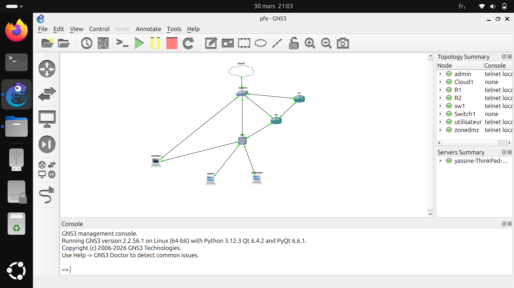

# 🚀 PFE 2026 : Automatisation de l'Infrastructure Réseau Agile (Ansible & GNS3)

**Réalisé par :** 
* **YASSINE EL GHAZI** (yassine.elghazi24@ump.ac.ma)
* **YOUSSEF EL AHMADI** (youssef.elahmadi24@ump.ac.ma)
* **NOUAMANE EL-JANHI** (nouamane.el-janhi24@ump.ac.ma)

## 📝 Description du Projet
Ce projet consiste à automatiser la configuration et la gestion d'une infrastructure réseau Cisco simulée sur **GNS3**. En utilisant **Ansible**, nous avons réussi à configurer plusieurs équipements (Routeurs et Switches) de manière centralisée, rapide et sans erreurs humaines.

### Objectifs atteints :
- Configuration automatique des Hostnames.
- Création et gestion des VLANs (Serveurs, Admin, Utilisateurs).
- Affectation dynamique des ports d'accès.
- Mise en place du routage dynamique **OSPF**.
- Configuration du protocole **SSH** pour la gestion à distance.
- Déploiement de serveurs **DHCP** pour l'adressage automatique.

---

## 🛠️ Logiciels & Images IOS utilisés
Pour reproduire ce lab, vous aurez besoin des images systèmes suivantes utilisées dans notre environnement :

| Équipement | Version de l'Image / Fichier | Lien de Téléchargement |
| :--- | :--- | :--- |
| **Routeur Cisco 7200** | c7200-adventerprisek9-mz.124-24.T8.bin | [Télécharger ICI](https://archive.org/download/CiscoIOS7200/c7200-adventerprisek9-mz.124-24.T8.bin) |
| **Routeur Cisco 3725** | c3725-adventerprisek9-mz.124-15.T14.bin | [Télécharger ICI](https://archive.org/download/CiscoIOSCollection/c3725-adventerprisek9-mz.124-15.T14.bin) |
| **Switch L2 (IOSv)** | vios_l2-adventerprisek9-m.ssa.high_iron_20200929.qcow2 | [Lien Cisco (virl)](https://learningnetworkstore.cisco.com/cisco-virtual-routing-and-forwarding/cisco-modeling-labs-personal/CML-PERSONAL.html) |
| **Routeur IOSv** | vios-adventerprisek9-m.vmdk.SPA.156-2.T.qcow2 | [Lien Cisco (virl)](https://learningnetworkstore.cisco.com/cisco-virtual-routing-and-forwarding/cisco-modeling-labs-personal/CML-PERSONAL.html) |
| **Machine Ansible** | Debian 12.6 (QCOW2) | [Télécharger Debian](https://cloud.debian.org/images/cloud/bookworm/latest/debian-12-generic-amd64.qcow2) |

---

## 🌐 Topologie du Réseau
L'infrastructure se compose de :
- **R1 & R2** : Routeurs Cisco 7200.
- **SW1** : Switch Cisco IOSvL2.
- **Clients** : PC Admin (VLAN 20), PC Utilisateur (VLAN 30), Zone DMZ/Serveur (VLAN 10).

---

## 🛠️ Guide d'Exécution (Les Commandes)

Pour lancer le projet, assurez-vous d'être dans le répertoire racine du projet et utilisez les commandes suivantes :

### 1. Vérification de la connectivité (Ping Ansible)
Avant de commencer, vérifiez que votre machine de gestion peut communiquer avec les équipements :

    ansible all -i hosts.ini -m ping
1. Lancement du déploiement global (Master Playbook)

    C'est la commande principale qui exécute toutes les configurations d'un seul coup (VLANs, Trunk, DHCP, OSPF) :

        ANSIBLE_HOST_KEY_CHECKING=False ansible-playbook -i hosts.ini master_pfe.yml

2. Lancement des modules spécifiques (Playbooks séparés)

    Si vous voulez lancer une partie précise de la configuration :

    Configuration du Switch (VLANs & SSH) :

        ANSIBLE_HOST_KEY_CHECKING=False ansible-playbook -i hosts.ini configure_switch.yml

    Configuration du Routage OSPF :

        ANSIBLE_HOST_KEY_CHECKING=False ansible-playbook -i hosts.ini ospf_config.yml

    Affectation des Ports aux VLANs :
        
        ANSIBLE_HOST_KEY_CHECKING=False ansible-playbook -i hosts.ini assign_ports.yml

## ✅ Tests et Résultats de Vérification

| Test | Commande de Vérification | Résultat Attendu |
| :--- | :--- | :--- |
| **VLANs** | `show vlan brief` | Les VLANs 10, 20 et 30 sont actifs sur SW1. |
| **Routage** | `show ip route` | R1 et R2 connaissent les réseaux des VLANs via OSPF. |
| **DHCP** | `ip dhcp` (sur VPCS) | Les clients reçoivent une IP dans leur plage respective (192.168.x.0/24). |
| **Connectivité** | `ping 192.168.10.10` | Communication réussie entre les différents VLANs. |
# 🚀 PFE 2026 : Automatisation de l'Infrastructure Réseau Agile (Ansible & GNS3)

**Réalisé par :** 
* **YASSINE EL GHAZI** (yassine.elghazi24@ump.ac.ma)
* **YOUSSEF EL AHMADI** (youssef.elahmadi24@ump.ac.ma)
* **NOUAMANE EL-JANHI** (nouamane.el-janhi24@ump.ac.ma)

## 📝 Description du Projet
Ce projet consiste à automatiser la configuration et la gestion d'une infrastructure réseau Cisco simulée sur **GNS3**. En utilisant **Ansible**, nous avons réussi à configurer plusieurs équipements (Routeurs et Switches) de manière centralisée, rapide et sans erreurs humaines.

### Objectifs atteints :
- Configuration automatique des Hostnames.
- Création et gestion des VLANs (Serveurs, Admin, Utilisateurs).
- Affectation dynamique des ports d'accès.
- Mise en place du routage dynamique **OSPF**.
- Configuration du protocole **SSH** pour la gestion à distance.
- Déploiement de serveurs **DHCP** pour l'adressage automatique.

---

## 🛠️ Logiciels & Images IOS utilisés
Pour reproduire ce lab, vous aurez besoin des images systèmes suivantes utilisées dans notre environnement :

| Équipement | Version de l'Image / Fichier | Lien de Téléchargement |
| :--- | :--- | :--- |
| **Routeur Cisco 7200** | c7200-adventerprisek9-mz.124-24.T8.bin | [Télécharger ICI](https://archive.org/download/CiscoIOS7200/c7200-adventerprisek9-mz.124-24.T8.bin) |
| **Routeur Cisco 3725** | c3725-adventerprisek9-mz.124-15.T14.bin | [Télécharger ICI](https://archive.org/download/CiscoIOSCollection/c3725-adventerprisek9-mz.124-15.T14.bin) |
| **Switch L2 (IOSv)** | vios_l2-adventerprisek9-m.ssa.high_iron_20200929.qcow2 | [Lien Cisco (virl)](https://learningnetworkstore.cisco.com/cisco-virtual-routing-and-forwarding/cisco-modeling-labs-personal/CML-PERSONAL.html) |
| **Routeur IOSv** | vios-adventerprisek9-m.vmdk.SPA.156-2.T.qcow2 | [Lien Cisco (virl)](https://learningnetworkstore.cisco.com/cisco-virtual-routing-and-forwarding/cisco-modeling-labs-personal/CML-PERSONAL.html) |
| **Machine Ansible** | Debian 12.6 (QCOW2) | [Télécharger Debian](https://cloud.debian.org/images/cloud/bookworm/latest/debian-12-generic-amd64.qcow2) |

---

## 🌐 Topologie du Réseau
L'infrastructure se compose de :
- **R1 & R2** : Routeurs Cisco 7200.
- **SW1** : Switch Cisco IOSvL2.
- **Clients** : PC Admin (VLAN 20), PC Utilisateur (VLAN 30), Zone DMZ/Serveur (VLAN 10).

---

## 🛠️ Guide d'Exécution (Les Commandes)

Pour lancer le projet, assurez-vous d'être dans le répertoire racine du projet et utilisez les commandes suivantes :

### 1. Vérification de la connectivité (Ping Ansible)
Avant de commencer, vérifiez que votre machine de gestion peut communiquer avec les équipements :

    ansible all -i hosts.ini -m ping
1. Lancement du déploiement global (Master Playbook)

    C'est la commande principale qui exécute toutes les configurations d'un seul coup (VLANs, Trunk, DHCP, OSPF) :

        ANSIBLE_HOST_KEY_CHECKING=False ansible-playbook -i hosts.ini master_pfe.yml

2. Lancement des modules spécifiques (Playbooks séparés)

    Si vous voulez lancer une partie précise de la configuration :

    Configuration du Switch (VLANs & SSH) :

        ANSIBLE_HOST_KEY_CHECKING=False ansible-playbook -i hosts.ini configure_switch.yml

    Configuration du Routage OSPF :

        ANSIBLE_HOST_KEY_CHECKING=False ansible-playbook -i hosts.ini ospf_config.yml

    Affectation des Ports aux VLANs :
        
        ANSIBLE_HOST_KEY_CHECKING=False ansible-playbook -i hosts.ini assign_ports.yml

## ✅ Tests et Résultats de Vérification

| Test | Commande de Vérification | Résultat Attendu |
| :--- | :--- | :--- |
| **VLANs** | `show vlan brief` | Les VLANs 10, 20 et 30 sont actifs sur SW1. |
| **Routage** | `show ip route` | R1 et R2 connaissent les réseaux des VLANs via OSPF. |
| **DHCP** | `ip dhcp` (sur VPCS) | Les clients reçoivent une IP dans leur plage respective (192.168.x.0/24). |
| **Connectivité** | `ping 192.168.10.10` | Communication réussie entre les différents VLANs. |

# 🚀 PFE 2026: Automation of Agile Network Infrastructure (Ansible & GNS3)

*Presented by:* 
* *YASSINE EL GHAZI* (yassine.elghazi24@ump.ac.ma)
* *YOUSSEF EL AHMADI* (youssef.elahmadi24@ump.ac.ma)
* *NOUAMANE EL-JANHI* (nouamane.el-janhi24@ump.ac.ma)

## 📝 Project Description
This project involves automating the configuration and management of a simulated Cisco network infrastructure on *GNS3*. Using **Ansible*, we successfully configured multiple devices (routers and switches) in a centralized, fast, and error-free manner.

### Objectives Achieved:
- Automatic configuration of hostnames.
- Creation and management of VLANs (Servers, Admin, Users).
- Dynamic assignment of access ports.
- Implementation of *OSPF* dynamic routing.
- Configuration of the *SSH* protocol for remote management.
- Deployment of *DHCP* servers for automatic addressing.

---

## 🛠️ Software & IOS Images Used
To reproduce this lab, you will need the following system images used in our environment:

| Equipment | Image Version / File | Download Link |
| :--- | :--- | :--- |
| *Cisco 7200 Router* | c7200-adventerprisek9-mz.124-24.T8.bin | [Download HERE](https://archive.org/download/CiscoIOS7200/c7200-adventerprisek9-mz.124-24.T8.bin) |
| *Cisco 3725 Router* | c3725-adventerprisek9-mz.124-15.T14.bin | [Download HERE](https://archive.org/download/CiscoIOSCollection/c3725-adventerprisek9-mz.124-15.T14.bin) |
| *L2 Switch (IOSv)* | vios_l2-adventerprisek9-m.ssa.high_iron_20200929.qcow2 | [Cisco link (virl)](https://learningnetworkstore.cisco.com/cisco-virtual-routing-and-forwarding/cisco-modeling-labs-personal/CML-PERSONAL.html) |
| *IOSv Router* | vios-adventerprisek9-m.vmdk.SPA.156-2. T.qcow2 | [Cisco link (virl)](https://learningnetworkstore.cisco.com/cisco-virtual-routing-and-forwarding/cisco-modeling-labs-personal/CML-PERSONAL.html) |
| *Ansible machine* | Debian 12.6 (QCOW2) | [Download Debian](https://cloud.debian.org/images/cloud/bookworm/latest/debian-12-generic-amd64.qcow2) |

---

## 🌐 Network Topology
The infrastructure consists of:
- *R1 & R2*: Cisco 7200 routers.
- *SW1*: Cisco IOSvL2 switch.
- *Clients*: Admin PC (VLAN 20), User PC (VLAN 30), DMZ/Server Zone (VLAN 10).

---

## 🛠️ Execution Guide (Commands)

To launch the project, ensure you are in the project's root directory and use the following commands:

### 1. Connectivity Check (Ansible Ping)
Before starting, verify that your management machine can communicate with the equipment:

ansible all -i hosts.ini -m ping
1. Launching the Global Deployment (Master Playbook)

This is the main command that executes all configurations at once (VLANs, Trunk, DHCP, OSPF):

ANSIBLE_HOST_KEY_CHECKING=False ansible-playbook -i hosts.ini master_pfe.yml

2. Launching Specific Modules (Separate Playbooks)

If you want to launch a specific part of the configuration:

Switch Configuration (VLANs & SSH):

ANSIBLE_HOST_KEY_CHECKING=False ansible-playbook -i hosts.ini configure_switch.yml

    Configuring OSPF Routing:

        ANSIBLE_HOST_KEY_CHECKING=False ansible-playbook -i hosts.ini ospf_config.yml

    Assigning Ports to VLANs:
        
        ANSIBLE_HOST_KEY_CHECKING=False ansible-playbook -i hosts.ini assign_ports.yml

## ✅ Tests and Verification Results

| Test | Verification Command | Expected Result |

| :--- | :--- | :--- |

| *VLANs* | show vlan brief | VLANs 10, 20, and 30 are active on SW1. |

| *Routing* | show ip route | R1 and R2 are aware of the VLAN networks via OSPF. |

| *DHCP* | ip dhcp (on VPCS) | Clients are receiving an IP address in their respective range (192.168.x.0/24). |

| *Connectivity* | ping 192.168.10.10 | Communication successful between the different VLANs. |